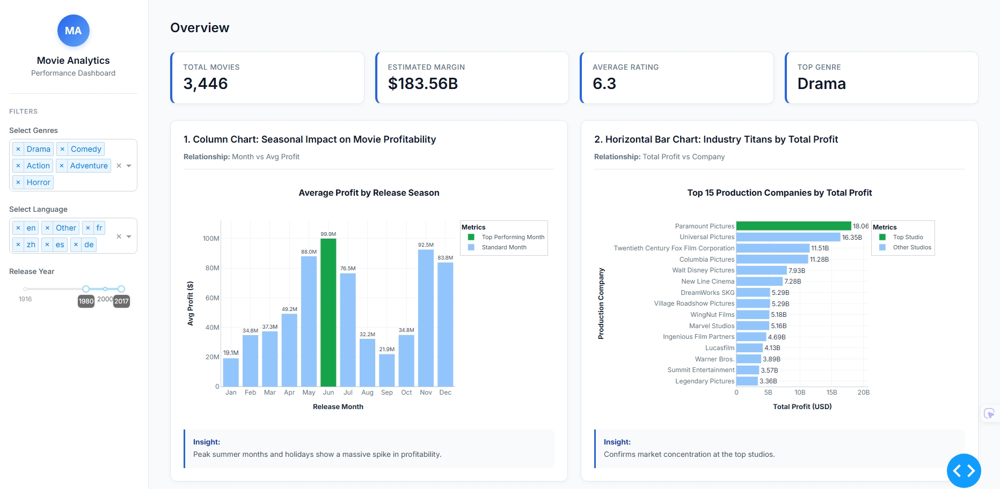
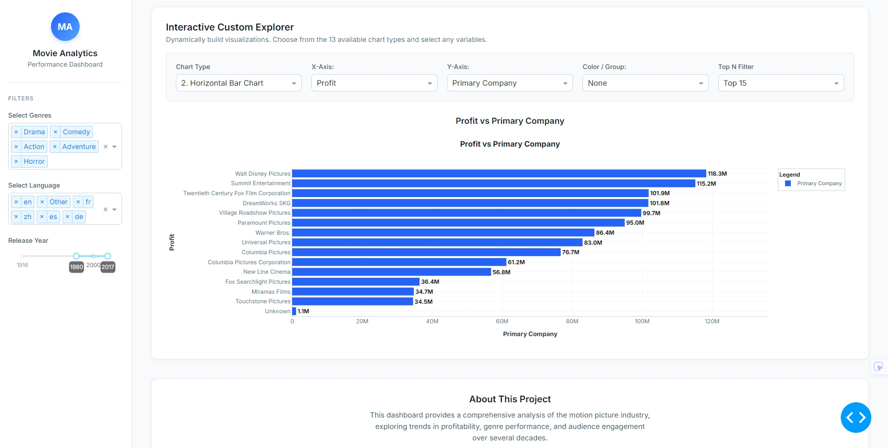

# 🎬 Movie Industry Analytics Dashboard

<!-- Full dashboard image removed from inline view because it is too large -->

<!-- Users can open the full-resolution image using the link below -->

[View Full Dashboard Image](assets/Dashboard_Full-Preview.png)


---

## 📋 Project Overview

This project is a **production-level Movie Analytics Dashboard** designed to analyze the global film industry using advanced **Data Engineering and Data Visualization techniques**.

The system is built using **Python, Plotly, and Dash**, and leverages the **TMDB 5000 Movies Dataset** to generate deep insights into:

* Financial Performance (Profit, ROI)
* Audience Satisfaction (Ratings, Votes)
* Production Strategy (Budget, Genre, Runtime)
* Seasonal Trends (Release timing impact)

---

## 🖥 Dashboard Preview Breakdown

### Overview Section



This section includes:

* KPI cards showing total movies, estimated margin, rating, and top genre
* Seasonal profit chart highlighting best release periods
* Top production companies ranked by total profit
* Budget risk distribution across tiers
* Genre satisfaction breakdown
* Rating vs marketing hype comparison

---

### Interactive Custom Explorer



This section allows full dynamic exploration of the dataset.

Features:

* Select any chart type (13 types supported)
* Choose X-axis and Y-axis variables
* Add grouping by category
* Control bubble size for advanced charts
* Apply Top N filter to reduce clutter

Controls explained:

* Chart Type
  Switch between predefined visualization types or use Auto Mode

* X-Axis / Y-Axis
  Select any numerical or categorical feature

* Color / Group
  Split data into categories

* Size (Bubble)
  Control bubble size in scatter charts

* Top N Filter
  Limit categories to top values for clarity

Auto Mode behavior:

* Detects best chart automatically
* Prevents invalid combinations
* Reduces manual work

---

## 🎯 Business Value

This dashboard answers real industry questions:

* Which movies generate real profit?
* Does budget guarantee success?
* Which genres dominate revenue?
* When should studios release films?

Use cases:

* Film studios decision making
* Investors evaluating projects
* Analysts exploring trends
* Students learning data analytics

---

## 🧠 Architecture Philosophy

The project follows a strict separation:

Backend handles:

* Cleaning
* Feature engineering
* Validation

Frontend handles:

* Visualization only

Result:

* Faster dashboard
* No redundant calculations
* Clean data flow

---

## 📊 Dataset Description

* Dataset Name: TMDB 5000 Movies Dataset
* Source: Kaggle
* File Used: `tmdb_5000_movies.csv`

---

## ▶️ Instructions to Run

```bash
# Clone the repository from GitHub
git clone https://github.com/YoussefAtef15/movie-industry-dashboard.git

# Navigate into the project folder
cd movie-industry-dashboard
```

```bash
# Create a virtual environment (isolates dependencies)
python -m venv venv
```

```bash
# Activate the virtual environment (Windows)
venv\Scripts\activate
```

```bash
# Install all required packages
pip install -r requirements.txt
```

```bash
# Run the dashboard application
python app.py
```

# Open this link in your browser after running the server

http://127.0.0.1:8050/

---

## 📌 Notes

* Full dashboard image is available via link only
* Large preview is intentionally hidden for readability
* Dashboard uses preprocessed data only
* Backend ensures consistency
* Designed for scalability

---
