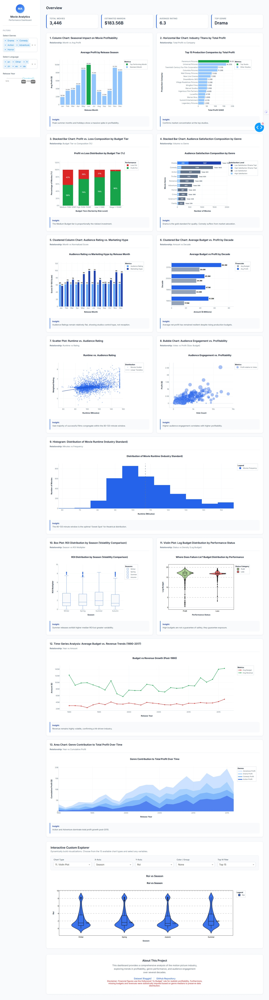

# 🎬 Movie Industry Analytics Dashboard




---

## 📋 Project Overview

This project is a **production-level Movie Analytics Dashboard** designed to analyze the global film industry using advanced **Data Engineering and Data Visualization techniques**.

The system is built using **Python, Plotly, and Dash**, and leverages the **TMDB 5000 Movies Dataset** to generate deep insights into:

* Financial Performance (Profit, ROI)
* Audience Satisfaction (Ratings, Votes)
* Production Strategy (Budget, Genre, Runtime)
* Seasonal Trends (Release timing impact)

---

## 🎯 Business Value

This dashboard answers real industry questions:

* Which movies generate real profit?
* Does budget guarantee success?
* Which genres dominate revenue?
* When should studios release films?

Use cases:

* Film studios decision making
* Investors evaluating projects
* Analysts exploring trends
* Students learning data analytics

---

## 🧠 Architecture Philosophy

The project follows a strict separation:

Backend handles:

* Cleaning
* Feature engineering
* Validation

Frontend handles:

* Visualization only

Result:

* Faster dashboard
* No redundant calculations
* Clean data flow

---

## 📊 Dataset Description

* Dataset Name: TMDB 5000 Movies Dataset
* Source: Kaggle
* File Used: `tmdb_5000_movies.csv`

### Key Attributes

* Budget & Revenue
* Genres (JSON → Multi-label)
* Popularity & Votes
* Runtime
* Release Date
* Production Companies

---

## ⚠️ Data Challenges

* Missing values
* Zero budgets and revenues
* JSON parsing
* Skewed distributions

---

## 📌 Data Assumptions

### Hollywood Rule Applied

Profit is estimated using:

Revenue - (2 × Budget)

Reason:

* Marketing costs often equal production budget
* Gives realistic profitability estimate

### Missing Values Strategy

* Imputed using genre medians
* Keeps distribution stable

---

## 📊 Dashboard Breakdown

### KPI Cards

* Total Movies → count after filters
* Estimated Margin → realistic profit
* Average Rating → Bayesian rating
* Top Genre → most frequent

---

### Charts Overview

1. Seasonal profit trends
2. Top studios by profit
3. Budget risk distribution
4. Genre satisfaction
5. Rating vs hype
6. Budget vs profit by decade
7. Runtime vs rating
8. Engagement vs profit
9. Runtime distribution
10. ROI volatility
11. Budget risk distribution
12. Budget vs revenue trends
13. Genre contribution over time

---

## 🚀 Key Features

### Backend Pipeline

* Multi-label encoding
* Smart imputation
* Bayesian rating
* ROI calculation
* Log transformation

---

### Frontend Dashboard

* 13+ interactive charts
* KPI cards
* Dynamic explorer
* Clean UI
* Responsive layout

---

## ⚡ Performance Optimization

* Heavy computation done in preprocessing
* Dashboard reads only clean data
* No runtime feature engineering
* Faster rendering

---

## 🛠 Tech Stack

* Python
* Pandas
* NumPy
* Plotly
* Dash
* HTML / CSS

---

## 📂 Project Structure

```text
movie_dashboard_project/
├── assets/
│   ├── style.css
│   └── dashboard_preview.png
├── data/
│   ├── raw_movies.csv
│   └── cleaned_movies.csv
├── notebooks/
│   └── preprocessing.ipynb
├── src/
│   ├── data_cleaning.py
│   ├── feature_engineering.py
│   └── utils.py
├── app.py
├── README.md
└── requirements.txt
```

---

## ▶️ Instructions to Run

```bash
git clone https://github.com/YoussefAtef15/movie-industry-dashboard.git
cd movie-industry-dashboard
```

```bash
python -m venv venv
```

```bash
venv\Scripts\activate
```

```bash
pip install -r requirements.txt
```

```bash
python app.py
```

Open:

http://127.0.0.1:8050/

---

## 📊 Core Insights

* Budget does not guarantee success
* Medium budget films are risky
* Summer drives profit
* Drama leads in quality
* Engagement drives revenue
* Optimal runtime is 90–120 minutes

---

## 🔮 Future Work

* Recommendation system
* ML profit prediction
* Real-time API
* Deep learning models

---

## 🤝 Contribution

Steps:

* Fork repo
* Create branch
* Make changes
* Submit pull request

---

## 📄 License

This project is for educational purposes.

---

## 📌 Notes

* Dashboard uses preprocessed data only
* Backend ensures consistency
* Designed for scalability

---
